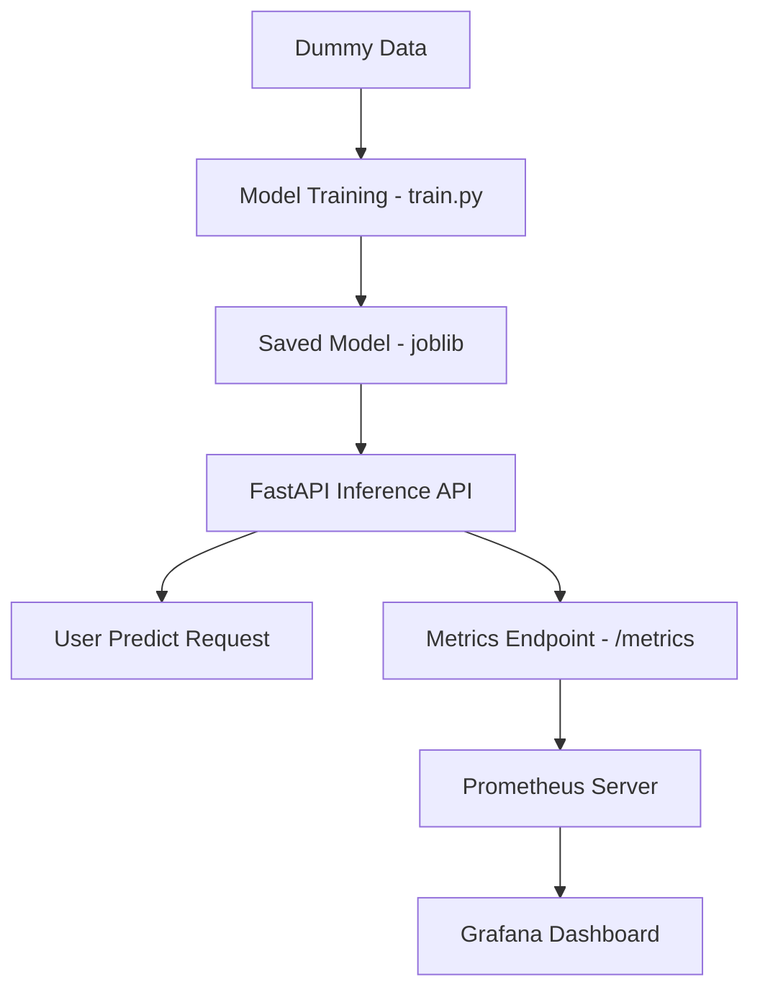

# 🧱 FastTrack-MLOps Architecture Overview

This document provides a full overview of the architecture, components, and workflow of the FastTrack-MLOps project.

---

## 📊 System Components

### 1. **Model Training Pipeline**
- **Tool**: `scikit-learn`
- **Script**: `src/train.py`
- **Description**: Generates a linear regression model from dummy data and saves it using `joblib`.

### 2. **Model Inference API**
- **Tool**: `FastAPI + Uvicorn`
- **Script**: `api/app.py`
- **Endpoint**: `/predict?x=<value>`
- **Metrics**: `/metrics` provided via `prometheus-fastapi-instrumentator`

### 3. **Dockerized Deployment**
- **Tool**: Docker
- **File**: `Dockerfile`
- **Function**: Wraps the FastAPI app into a lightweight, reproducible container for production use.

### 4. **CI/CD Pipeline**
- **Tool**: GitHub Actions
- **Workflow File**: `.github/workflows/ci-cd.yml`
- **Steps**:
  - Checkout code
  - Set up Python environment
  - Install dependencies
  - Train model
  - Test inference
  - Build and test Docker container

### 5. **Monitoring**
- **Tools**: Prometheus + Grafana
- **Prometheus Config**: `monitoring/prometheus.yml`
- **Grafana Dashboard**: `monitoring/grafana-dashboard.json`
- **Function**: Collects API latency, request counts, and other performance metrics

---

## 🔁 Data and Process Flow



---

## 📂 Directory Structure

```
mlops-demo/
├── api/                # FastAPI app
├── src/                # Model training & prediction scripts
├── model/              # Saved model (generated at runtime)
├── monitoring/         # Prometheus and Grafana configs
├── .github/workflows/  # CI/CD workflow
├── Dockerfile
├── requirements.txt
├── architecture.md
├── README.md
└── .gitignore
```

---

## 🧠 Design Principles

- **Reproducibility**: Containerized builds and dependency lock
- **Simplicity**: Linear model with clear inputs/outputs for demo clarity
- **Extensibility**: Modular layout allows easy upgrades (e.g., switch to MLflow, add S3, batch jobs)
- **Observability**: Metrics integration from day one
- **Automation**: Fully automated CI/CD via GitHub Actions

---

## 🚀 Future Improvements

- [ ] Add MLflow experiment tracking
- [ ] Add database or external data ingestion
- [ ] Integrate object storage (e.g., MinIO, AWS S3)
- [ ] Include unit & integration tests
- [ ] Build real-time dashboard with Grafana panels

---
